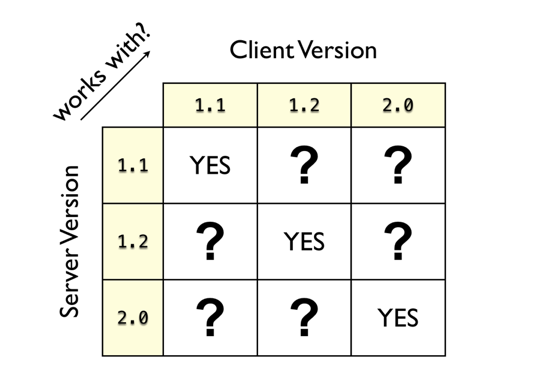
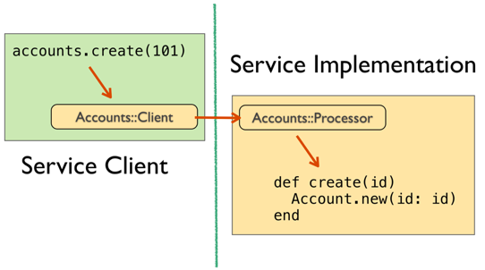
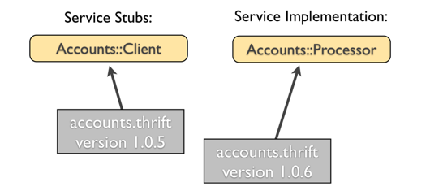
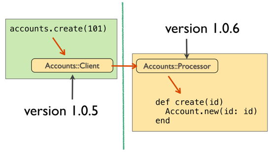

## Introduction

This repo is meant to illustrate best practices for managing version
compatibility of services based on thrift.  It focuses on an SOA
architecture where you generally run one version of a service
implementation but may have clients with older versions of the service
stubs.

### Terminology

When developing a service implementation, a principle design
consideration is compatibility with clients of the service.  In this
context there is a notion of backward compatibility and forward
compatibility.  Forward compatibility describes a version of the
service that will work with clients of future versions of that
service.  

In an SOA environment where you intend to only ever run one version of
a given service we're not going to concern ourselves with forward
compatibility (top right in the matrix) and instead focus on backward
compatibility (bottom left).

Backward compatibility is a quality of a service implementation where
it will work with clients running with an earlier version of the
client libraries.  For Thrift this means clients using an older
version of the service stubs will still work with a newer version.

Consider a typical deployment of a given Thrift service.  

The interface is defined in the IDL which is used to generate service
stubs for a client application and a platform specific service
interface that is implemented by the service.

If the service implementor now modifies the service interface, a new
version of the service stubs is generated.  But not all clients will
upgrade their stubs immediately.  The new version of the service is
considered *backward compatible* with the earlier generated stubs if
the clients using the old service stubs can still connect to the
service and invoke methods successfully.  More specifically, the new
verison of the service is _binary backward compatibile_ with the
earlier versions.

A stronger notion of backward compatibility is *source backward
compatibility*.  This means a service client will be able to upgrade
to the new version by simply replacing it's service stubs with the
latest versions generated by the server.  If a new version of the
stubs requires the client code to be changed before it will work, then
that new version of the server is _source backward incompatibile_.

Note that we are focusing on the compatibility of interfaces at the
protocol layer only.

### Semantic Versioning

In order to identify the compatibility characteristics of any version
of the service, we can adopt a form of [semantic
versioning](http://semver.org/) tailored to the notions of source and
binary compatibility.  With this proposal, the form the definitions of
major, minor and patch numbers look like this:

    MAJOR.MINOR.PATCH

#### PATCH

An increment of the PATCH number represents a change in the server
interface that is source backward compatible with the previous
version.  Client apps can update their stubs without having to modify
their source.  For a java app this would mean simply updating the jar
file with the stub classes.  In practice this isn't exactly a patch.
It could include additions of methods to the service interface.

#### MINOR

An increment of the MINOR (middle) number represents a binary backward
compatible, but source backward _incompatible_ change to the
interface.  Client apps upgrading to this version may require
recompiling or changes to the source code, however clients not upgrading
their service stubs may still connect to the service.

In other words, when the version of the server is 1.5.0, any client using
stubs compiled against any 1.*.* version of the server will still be able
to connect to it.

#### MAJOR

In increment of the MAJOR (first) number represents an incompatible
upgrade (source and binary) to the previous version.  Clients will not be
able to connect to this version of the service without updating their
service stubs to the latest version, which will require recompilation and
changes to the source.  

In other words, you can't connect to a 2.* service with stubs generated
from a 1.* version of the IDL.

## Compatibility Examples in Thrift

Whenever the IDL for a service is modified, new service stubs are generated.
Depending on the change, the new version may be source compatible, binary 
compatible, or completely incompatible with clients trying to connect
with older versions of the stubs.

Following are examples of each kind of change.

### Source Compatible Changes

The following changes to the service interface require no changes to
any clients.

* Adding new methods or structs
* Adding a non-required field to a struct
* Changing a method return type from void to anything else (ruby only)
* Removing an exception from a method signature (ruby only)

If the client is java, the "ruby only" changes may require the java client
code be recompiled to prevent VM errors.

### Binary Compatible Changes

The following changes to a service interface will require clients
update their code when updating to the latest service stubs.

* Removing a field from a struct
* Renaming a struct
* Adding an argument to a method with or without a default value
* Removing an argument from a method
* Changing the order of arguments in a method
* Changing the namespace 
* Adding an exception to a method signature whose return type is void

These changes will still allow older clients to connect to the new
version of the server.

It may be surprising that throwing a new exception is compatible with
older clients that don't know anything about the exception.
Evidently, thrift just silences the exception when the return type is
void.  If the return type is not void then an internal thrift
exception is thrown.

### Binary Backward Incompatible Changes

The following changes require all clients to update their stubs to the
latest versions generated.  Clients connecting with older versions of
the stubs will get exceptions on their method invocations.

* Removing or renaming a method
* Removing a struct definition
* Changing the declared type of a return value, or changing it to void
* Adding an exception to a method with a non-void return type

## Running the Examples

You can see examples of the compatible changes listed above in a
sample thrift service called the `AIS::Accounts` service.

There are three different versions of this service:

* 1.0.0: The first version
* 1.0.1: The second version with changes that are source compatible with clients written with the V1 stubs
* 1.1.0: The third version with additional changes that are binary compatible but not source compativle with V1 clients.
* 2.0.0: Major version which is not compatible with 1.* clients.

You can run the [server](examples/server.rb) as a rack application.
The server implements versions 1.1.0 and 2.0.0 as distinct rack
applications on separate endpoints.

You can a sample client with the [client runner](examples/client.rb)
ruby script.  It take a single command line argument, the version of
the interface to use: 1.0.0, 1.0.1, 1.1.0, or 2.0.0.  To demonstrate
binary compatibility, the 1.* versions of the client all connect to
the local 1.1.0 server stood up by the server rack app.  When you run
the 2.0.0 version of the client it connects to the 2.0.0 endpoint in
the rack app.

First install the required gems:

    gem install thrift
    gem install thin

Next generate the service stubs:

    cd examples
    ./gen.sh

Start up the server.  This instantiates server implementations of the
1.1.0 and 2.0.0 interfaces.

    rackup

Now run each version of the client.

    ruby client.rb 1.0.0
    ruby client.rb 1.0.1
    ruby client.rb 1.1.0
    ruby client.rb 2.0.0

In [client.rb](examples/client.rb) you can study the changes required
in each of the versions of the client in order to upgrade the stubs
for that version.

So what's the point of runnable examples?  If you have a question
about the effect of any particular kind of change on clients the best
way to answer it is to actually try it out.  These examples all use
ruby but you could verify some of the assumptions using clients
written in other languages.
